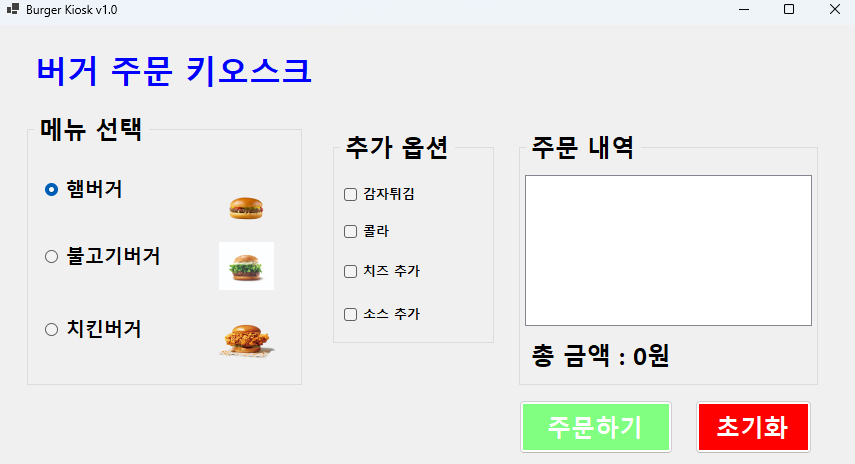
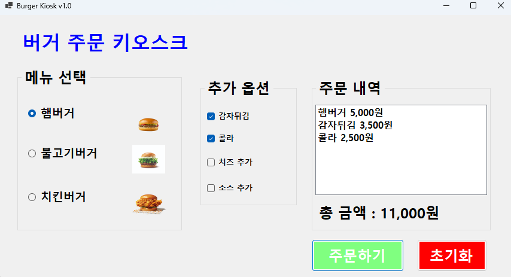
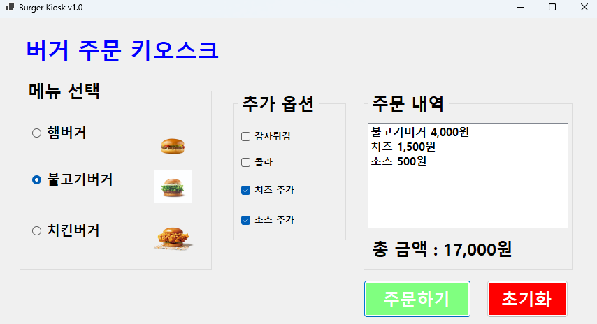
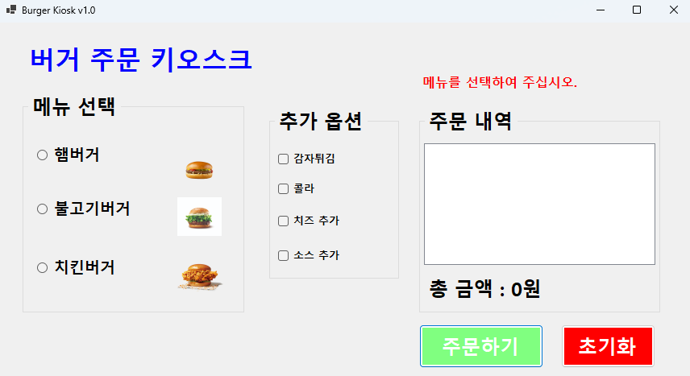
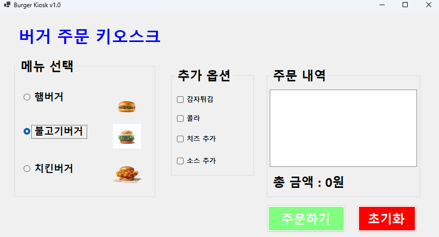
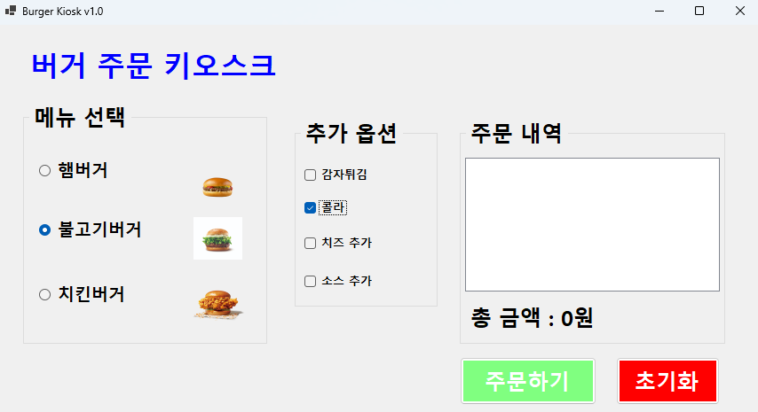
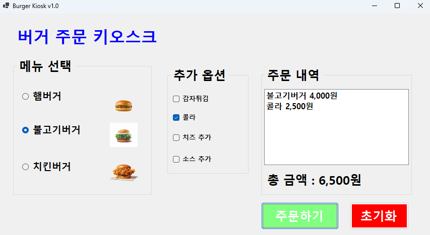

# BurgerKiosk

# (C# 코딩) BurgerKiosk 과제

## 개요
- C# 프로그래밍 학습
- 1줄 소개: 메세지를 입력하고 이를 로그에 기록하는 메신저 프로그램
- 사용한 플랫폼:
  - C#, .NET Windows Forms, Visual Studio, GitHub
- 사용한 컨트롤:
  - Label, Button, RadioButton, CheckBox, GroupBox, ListBox, PictureBox
- 사용한 기술과 구현한 기능:
  - Visual Studio를 이용하여 UI 구현

## 실행 화면 (과제1)
- 과제1 코드의 실행 스크린샷

- 과제 내용
  - RadioButton과 CheckBox 등을 적절히 배치합니다.
  - GroupBox로 적절하게 그룹으로 묶습니다.
  - 주문 내역과 총 금액을 표시합니다.
  - 다시 주문할 수 있도록 초기화합니다.

- 구현 내용과 기능 설명
  - 주문하기 버튼을 누를 시 주문 내역과 총 금액이 ListBox와 Label에 표시
  - 초기화 버튼을 누를 시 주문 내역과 총 금액이 초기화
  - RadioButton을 이용하여 햄버거 1개만 선택 가능하도록 구현
  - CheckBox를 이용하여 추가옵션을 선택할 수 있도록 구현
  - GroupBox로 햄버거와 추가옵션을 그룹으로 묶어 구현
  - N0을 이용하여 금액을 천 단위로 구분하여 표시

## 실행 화면 (과제2)
- 과제2 코드의 실행 스크린샷

- 과제 내용
  - 아무것도 선택하지 않고 주문하기 버튼을 누르면 에러 메시지 표시

- 구현 내용과 기능 설명
  - ActiveControl을 이용하여 초기 포커스가 라벨로 가게 설정
  - Label.Visible을 이용하여 주문하기 버튼을 눌렀을 때 메뉴가 선택되지 않았을 경우 에러 메시지 표시

## 실행 화면 (과제3)
- 과제3 코드의 실행 스크린샷

- 과제 내용
  - Tab을 이용해서 GroupBox 사이를 이동하기
  - 방향키를 이용해서 선택 아이템 사이를 이동하기
  - 스페이스바를 이용해서 아이템 선택하기
  - Enter키로 버튼을 누르기

- 구현 내용과 기능 설명
  - Tab순서를 이용해서 Tab키로 GroupBox 사이를 이동할 수 있도록 구현
  - KeyDown을 이용해서 버튼을 엔터키로 누를 수 있도록 구현